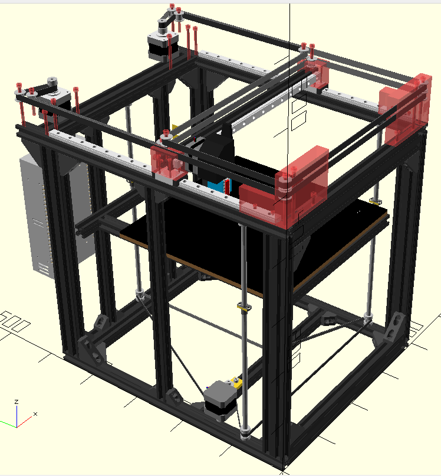

# vn-corexy
Very Narrow CoreXY 3D Printer

This is OpenScad source code to generate hardware parts for vn-corexy.

**WARNING: WORK IN PROGRESS**

# Requirements
- OpenScad https://www.openscad.org/
- NopSCADlib library https://github.com/nophead/NopSCADlib

# Copyright
(C) 2020-2021 Marek Wodzinski <majek@w7i.pl>

# License
This work is licensed under Creative Commons Attribution-ShareAlike 4.0 International License.
You should have received a copy of the license along with this work. 
If not, see <http://creativecommons.org/licenses/by-sa/4.0/
