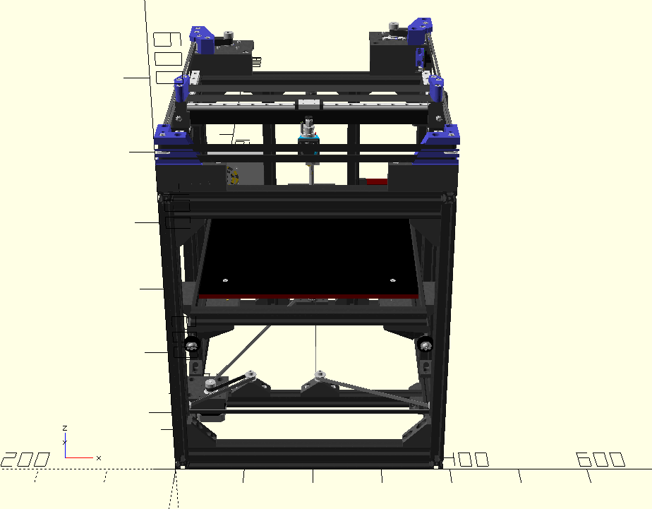

# vn-corexy
Very Narrow CoreXY 3D Printer

vn-corexy is designed around 300x300 mm build plate with goal to be
as compact as possible with focus on width. Current dimensions are
390(width)x520(depth)x530(height). While width and depth dimensions
are final, height could change.

In this repository there is OpenScad source code with 3D printer design.
There are many parameters that can be customized. In Customizer you could
choose which printed parts you want to render and save as STL file,
or render them all at once.
There are also ECHO messages in console that can be used to prepare BOM,
for example there are messages with all lengths of specific extrusion types,
GT2 belt lengts are also calculated.

**WARNING: THIS IS WORK IN PROGRESS**

Forum thread (in Polish): https://reprapy.pl/viewtopic.php?f=10&t=7225

# Requirements
- OpenScad https://www.openscad.org/
- NopSCADlib library https://github.com/nophead/NopSCADlib (version 18.2.0)

# Known issues
- MGN12 carriage sticks 3.5mm out of frame
- bed frame should be 10mm shorter to use 4 the same wheel supports
- bed frame wheels supports are temporary, will be changed in future

# Copyright & license
(C) 2020-2022 Marek Wodzinski <majek@w7i.pl>

This work is licensed under Creative Commons Attribution-ShareAlike 4.0 International License.
You should have received a copy of the license along with this work. 
If not, see <http://creativecommons.org/licenses/by-sa/4.0/
